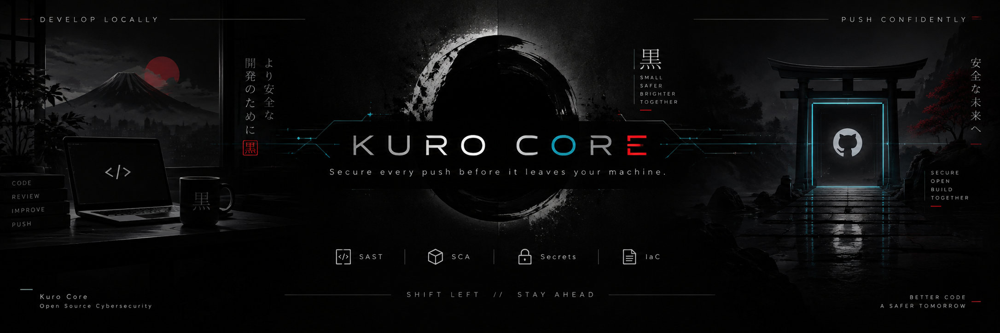
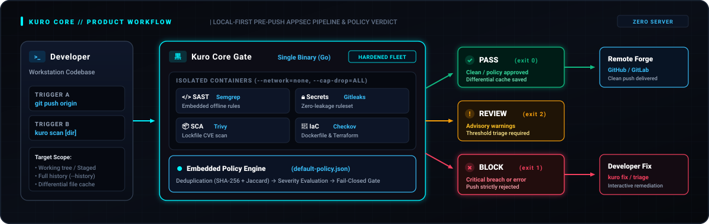
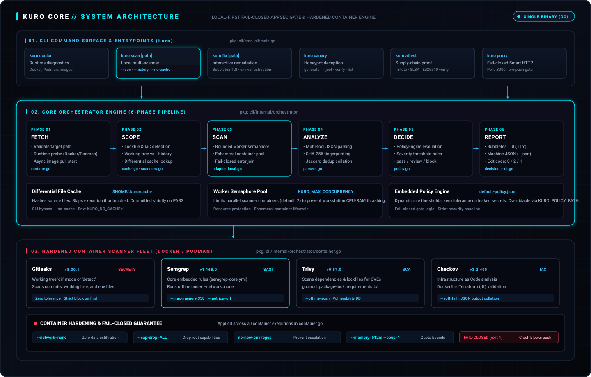
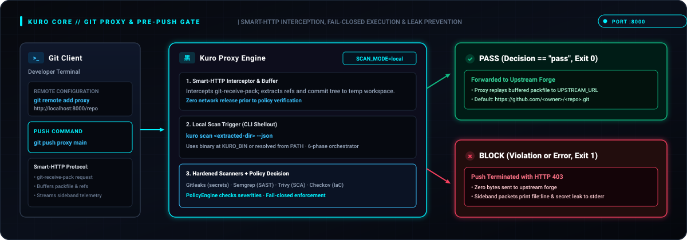

<div align="center">



# KURO CORE

**Local-First AppSec Gate**  
*Secure every push before it leaves your machine.*

[](https://github.com/Haiagari/kuro-core/actions/workflows/ci.yml)
[](https://github.com/Haiagari/kuro-core/actions/workflows/secret-scanning.yml)
[](https://github.com/Haiagari/kuro-core/releases)
[](https://go.dev)
[](LICENSE)

[Quickstart](QUICKSTART.md) • [Architecture](docs/ARCHITECTURE.md) • [Scanner Fleet](docs/SCANNER-ARCHITECTURE.md) • [CLI & API](docs/API.md) • [Contributing](CONTRIBUTING.md)

</div>

---

## What is Kuro Core?

**Kuro Core** (`黒`) is a single-binary security gate designed to stop credential leaks, code vulnerabilities, and insecure infrastructure code before source leaves the developer workstation.

Unlike centralized server platforms that require external infrastructure, Kuro Core runs entirely local-first. It coordinates industry-standard scanners (Gitleaks, Semgrep, Trivy, and Checkov) inside hardened, ephemeral containers with zero network egress, resource throttling, differential caching, and deterministic exit codes.

<p align="center">
  
</p>

---

## Why Kuro Core?

- **Zero External Infrastructure** — Operates entirely on the workstation via Docker or Podman. No PostgreSQL, NATS, MinIO, or central orchestrators required.
- **Fail-Closed Security Gate** — Container errors, timeouts, or policy breaches strictly trigger `exit 1` (`decision: block`). No silent passes on scanner failure.
- **Pre-Push Git Proxy** — Native Smart-HTTP proxy intercepts `git push` on port `:8000`, materializes push data in temporary work directories for scanning, and rejects policy breaches before reaching upstream forges.
- **Hardened Execution Envelope** — Scanners execute with `--network=none`, `--cap-drop=ALL`, `no-new-privileges`, and bounded CPU/memory quotas.
- **Differential File Cache** — Source hashes are stored in `$HOME/.kuro/cache`. Clean scans short-circuit subsequent runs with zero container overhead.
- **Interactive Secret Remediation** — `kuro fix` provides a terminal TUI to inspect and replace exposed credentials with environment variables across Go, Python, and JS/TS.
- **Canary Tokens & Attestation** — Generate HMAC-tagged deception credentials (`kuro canary`) and verify in-toto / SLSA provenance envelopes (`kuro attest`).

---

## Quick Start

### 1. Installation

**Recommended: Release script**

```bash
curl -sSL https://raw.githubusercontent.com/Haiagari/kuro-core/main/scripts/install.sh | sh

# Pin version:
curl -sSL https://raw.githubusercontent.com/Haiagari/kuro-core/main/scripts/install.sh | sh -s -- v0.1.1
```

**Build from source:**

```bash
git clone https://github.com/Haiagari/kuro-core.git
cd kuro-core
make build          # Outputs to bin/kuro
sudo make install   # Installs to /usr/local/bin/kuro
```

*Prerequisites: Docker 24+ or Podman 4+. Go 1.26+ only if compiling from source.*

### 2. Verify Environment

```bash
kuro doctor
```

Validates container runtime health, scanner image availability, git binary, disk space, and Kuro version.

### 3. Run a Scan

```bash
# Interactive TUI mode on a TTY:
kuro scan ./my-project

# Machine-readable JSON output (flags work after path):
kuro scan ./my-project --json

# Bypass differential cache:
kuro scan ./my-project --no-cache
```

### Deterministic Exit Codes

| Decision | Exit Code | Meaning |
| --- | --- | --- |
| `pass` | `0` | All policy checks approved; cache committed |
| `review` | `2` | Advisory findings detected; threshold review needed |
| `block` | `1` | Policy violation, secret leak, or scanner error |

### Validation kit

See the [demo walkthrough](docs/market-validation/DEMO.md) and [interview guide](docs/market-validation/INTERVIEW-GUIDE.md) for the Phase 0/1 validation materials.

---

## System Architecture

Kuro Core coordinates local analysis across a 6-phase pipeline: **Fetch → Scope → Scan → Analyze → Decide → Report**.

<p align="center">
  
</p>

### Pipeline Overview

1. **Fetch** — Resolves target paths, probes container engine (Docker daemon preferred, Podman fallback), and initiates asynchronous image pulls.
2. **Scope** — Detects lockfiles (`go.mod`, `package-lock.json`, `requirements.txt`) and IaC configurations (`Dockerfile`, `*.tf`). Checks differential cache.
3. **Scan** — Spawns isolated container scanners governed by a counting semaphore (`KURO_MAX_CONCURRENCY=2` by default) to protect system resources.
4. **Analyze** — Ingests scanner JSON, computes SHA-256 fingerprints, and performs Jaccard similarity deduplication.
5. **Decide** — Evaluates findings against embedded `rules/default-policy.json` (customizable via `KURO_POLICY_PATH`).
6. **Report** — Emits Bubbletea TUI output, summary text, or JSON envelopes with deterministic process exit codes.

For detailed internals, see [docs/ARCHITECTURE.md](docs/ARCHITECTURE.md).

---

## Scanner Fleet & Hardening

Every scanner runs in a strictly confined container sandbox defined in [`cli/internal/orchestrator/container.go`](cli/internal/orchestrator/container.go):

| Scanner | Pinned Version | Layer | Runtime Hardening |
| --- | --- | --- | --- |
| **Gitleaks** | `v8.30.1` | Secrets | `--network=none`, `--cap-drop=ALL`, `:ro,Z` mount |
| **Semgrep** | `v1.165.0` | SAST | Embedded `semgrep-core.yml`, `--max-memory 350`, offline |
| **Trivy** | `v0.57.0` | SCA (Deps) | `--offline-scan` with automated fallback |
| **Checkov** | `v3.2.400` | IaC | `--soft-fail`, isolated container execution |
| **TruffleHog** | `v3.81.0` | Deep Secrets | Optional history mode (`kuro scan --history`) |

### Isolation Constraints

```text
docker|podman run --rm
  --network=none                     # Zero data exfiltration
  --cap-drop=ALL                     # Drop all Linux root capabilities
  --security-opt=no-new-privileges   # Prevent privilege escalation
  --memory=512m --cpus=1.0           # Host resource caps per container
  -v <host_path>:<mount>:ro,Z        # Read-only source with SELinux relabeling
```

For offline ruleset details and container mounts, see [docs/SCANNER-ARCHITECTURE.md](docs/SCANNER-ARCHITECTURE.md).

---

## Local Git Proxy (Pre-Push Gate)

The built-in Smart-HTTP proxy blocks insecure pushes before commits reach your remote repository:

<p align="center">
  
</p>

### Running the Proxy

```bash
# Start proxy in-process on :8000
./bin/kuro proxy

# Configure git remote:
git remote add proxy http://localhost:8000/<owner>/<repo>.git
git push proxy main
```

- **Clean Push (`PASS`)** — Proxy transparently streams the buffered packfile to the upstream forge (default: `https://github.com`).
- **Policy Violation (`BLOCK`)** — Push is immediately terminated with HTTP 403 Forbidden. Sideband error packets report offending files and line numbers directly to your terminal stderr. Zero bytes leak upstream.

Configuration variables:

- `LISTEN_ADDR` (default `:8000`, `--addr` flag)
- `UPSTREAM_URL` (default `https://github.com`, `--upstream` flag)
- `SCAN_MODE` (default `local`, executes `kuro scan --json`)
- `KURO_BIN` (path to CLI binary, defaults to `kuro` on `PATH`)

---

## Core vs Enterprise

| Dimension | Kuro Core (`Haiagari/kuro-core`) | Kuro Enterprise (`Haiagari/kuro-enterprise`) |
| --- | --- | --- |
| **Deployment** | Single binary (`bin/kuro`) | Distributed server cluster |
| **Execution** | Local Docker / Podman containers | Firecracker MicroVMs / remote worker pool |
| **Datastores** | None (ephemeral / file cache) | PostgreSQL, NATS, MinIO, Redis |
| **Interface** | CLI, Bubbletea TUI, local proxy | Web dashboard, REST/gRPC API, webhooks |
| **Proxy Mode** | `SCAN_MODE=local` | `SCAN_MODE=api` (`KURO_URL` + `KURO_API_KEY`) |

*This repository contains Kuro Core. Server HTTP APIs, central audit dashboards, and multi-tenant management live in Kuro Enterprise.*

---

## CLI Quick Reference

```bash
# Diagnostics & Health
kuro doctor [--json]                                 # Validate runtime, images, tools
kuro version                                         # Display version string

# Security Scanning
kuro scan <path> [--json] [--no-cache] [--history]   # Local multi-scanner gate
kuro fix [path] [--dry-run] [--auto]                 # Interactive secret remediation

# Deception & Attestation
kuro canary generate [--type aws|github|slack|jwt]   # Generate honeypot tokens
kuro canary inject <dir> [--type ...]                # Inject canary credentials
kuro canary verify <token|file>                      # Verify canary legitimacy
kuro attest verify [--commit SHA] [--pubkey key]     # Verify in-toto / SLSA provenance
kuro attest keygen                                   # Generate Ed25519 keypair

# Pre-Push Git Proxy
kuro proxy [--addr :8000] [--upstream URL]          # Start local pre-push proxy
```

Full CLI and output specifications: [docs/API.md](docs/API.md).

---

## Documentation

- [QUICKSTART.md](QUICKSTART.md) — Comprehensive first-time setup guide
- [docs/ARCHITECTURE.md](docs/ARCHITECTURE.md) — Detailed pipeline and proxy internals
- [docs/SCANNER-ARCHITECTURE.md](docs/SCANNER-ARCHITECTURE.md) — Scanner images, hardening, and offline execution
- [docs/API.md](docs/API.md) — JSON output schema and process exit code contracts
- [docs/ATTESTATION.md](docs/ATTESTATION.md) — Cryptographic provenance and verification
- [AGENTS.md](AGENTS.md) — Repository guidelines and constraints for automated assistants
- [CONTRIBUTING.md](CONTRIBUTING.md) — Development workflow, testing, and PR conventions
- [SECURITY.md](SECURITY.md) — Vulnerability reporting and security policies
- [CHANGELOG.md](CHANGELOG.md) — Release notes and version history

---

## License

Kuro Core is licensed under the [GNU Affero General Public License v3.0](LICENSE) (`AGPL-3.0-only`). See [NOTICE](NOTICE) for attribution and dependencies.
