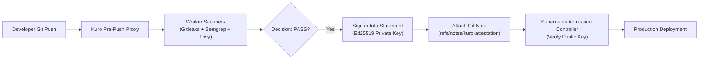

# Cryptographic Supply Chain Attestation — Kuro

> **Specification**: in-toto Statement v1 / SLSA Provenance v1  
> **Predicate**: `https://kuro.dev/attestation/security-gate/v1`  
> **Signature Algorithm**: Ed25519 (Asymmetric Digital Signatures)  
> **Version**: v1.5.0

---

## 1. Overview

Kuro implements an immutable, hardware-compatible **Cryptographic Attestation Engine**. Whenever code satisfies the zero-trust security policy (`PASS` / `APPROVED`), Kuro generates an authenticated in-toto statement and signs it with the server's Ed25519 private key.

The signature is attached directly to the git commit via `refs/notes/kuro-attestation` or exported as `kuro-attestation.json`.



---

## 2. in-toto Statement Payload Format

```json
{
  "_type": "https://in-toto.io/Statement/v1",
  "subject": [
    {
      "name": "https://github.com/Haiagari/kuro.git",
      "digest": {
        "commit": "d3b07384d113edec49eaa6238ad5ff00"
      }
    }
  ],
  "predicateType": "https://kuro.dev/attestation/security-gate/v1",
  "predicate": {
    "decision": "PASS",
    "scan_id": "00000000-0000-0000-0000-000000000001",
    "scanners": [
      "gitleaks",
      "semgrep",
      "trivy",
      "checkov"
    ],
    "policy_hash": "e3b0c44298fc1c149afbf4c8996fb92427ae41e4649b934ca495991b7852b855",
    "findings_count": {
      "critical": 0,
      "high": 0,
      "medium": 0,
      "low": 0
    },
    "issued_at": "2026-08-31T12:00:00Z",
    "issuer": "Kuro Security Gatekeeper v1.5.0"
  }
}
```

---

## 3. CLI Commands Reference

### 3.1 Generate Attestation Keypair

```bash
kuro attest keygen
```

### 3.2 Verify Commit Signature in CI/CD or Admission Controller

```bash
# Verify using environment variable KURO_ATTESTATION_PUBLIC_KEY
kuro attest verify --commit HEAD

# Verify using explicit public key file
kuro attest verify --commit d3b0738 --pubkey /etc/kuro/attestation.pub
```

### 3.3 Inspect Standalone Attestation Envelope

```bash
kuro attest inspect ./kuro-attestation.json
```

---

## 4. Kubernetes Admission Controller Integration

To enforce that **only cryptographically attested commits** are deployed into production Kubernetes clusters:

```yaml
apiVersion: admissionregistration.k8s.io/v1
kind: ValidatingAdmissionWebhook
metadata:
  name: kuro-attestation-gate.security.kuro.dev
webhooks:
  - name: verify-commit.kuro.dev
    rules:
      - apiGroups: ["apps"]
        apiVersions: ["v1"]
        operations: ["CREATE", "UPDATE"]
        resources: ["deployments", "statefulsets"]
    clientConfig:
      service:
        name: kuro-attestation-verifier
        namespace: security-gate
        path: /validate
```
