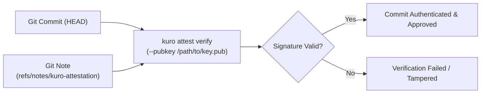

# Cryptographic Attestation — Kuro Core

> **Specification**: in-toto Statement v1 / SLSA Provenance v1  
> **Predicate**: `https://kuro.dev/attestation/security-gate/v1`  
> **Signature Algorithm**: Ed25519 (Asymmetric Digital Signatures)  
> **Version**: v0.1.0

---

## 1. Overview

Kuro Core includes built-in verification tools for cryptographic supply chain attestations (`kuro attest verify`). When an authorized security engine approves a commit, an in-toto provenance statement signed with an Ed25519 key is stored in git notes (`refs/notes/kuro-attestation`) or exported as a standalone JSON envelope.

Kuro Core CLI allows developers to inspect and verify these signatures offline without external infrastructure.



---

## 2. CLI Usage

### Verify commit attestation
```bash
# Verify the current HEAD commit using a public key
kuro attest verify --pubkey /path/to/attestation.pub

# Verify a specific commit
kuro attest verify --commit abc1234 --pubkey /path/to/attestation.pub
```

### Inspect an attestation envelope
```bash
# Decode and display the formatted in-toto statement
kuro attest inspect ./kuro-attestation.json
```

### Generate a keypair (for testing or local signing)
```bash
kuro attest keygen
```
